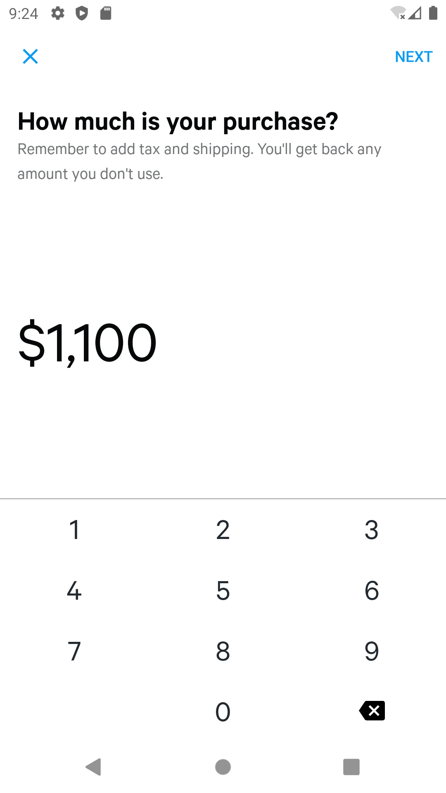
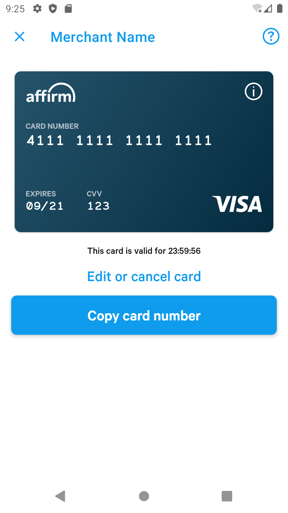

## New Checkout Flow

We provide a new vcn checkout process, which will include these two screens at the beginning and the end

<p align="center">


</p>

- Start the new vcn checkout flow. Also you must include a checkout object, just like before
```
    Affirm.startNewVcnCheckoutFlow(MainActivity.this, checkoutModel());
```

- We also provide an API to open the vcn display page directly (the prerequisite is that the checkout has a cache)
Also you must include the checkout object, we can edit the checkout on the vcn display page.
```
    if (Affirm.existCachedCard()) {
        Affirm.startVcnDisplay(MainActivity.this, checkoutModel());
    }
```